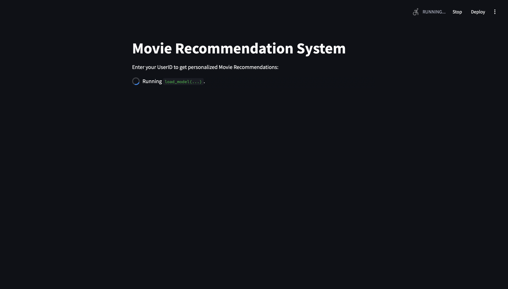
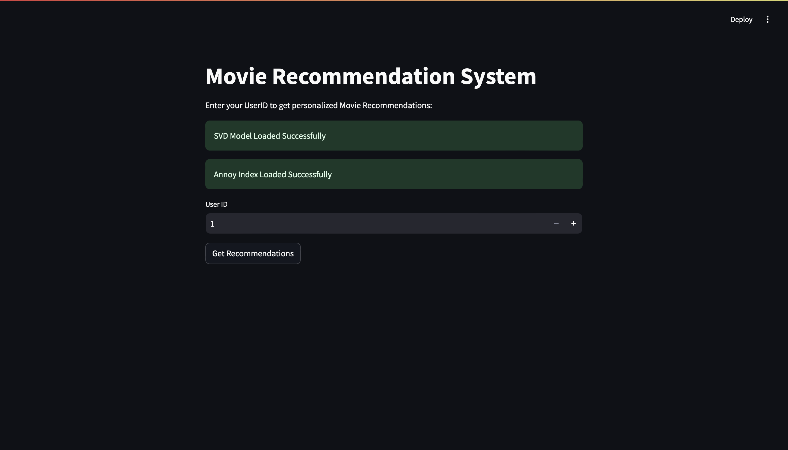
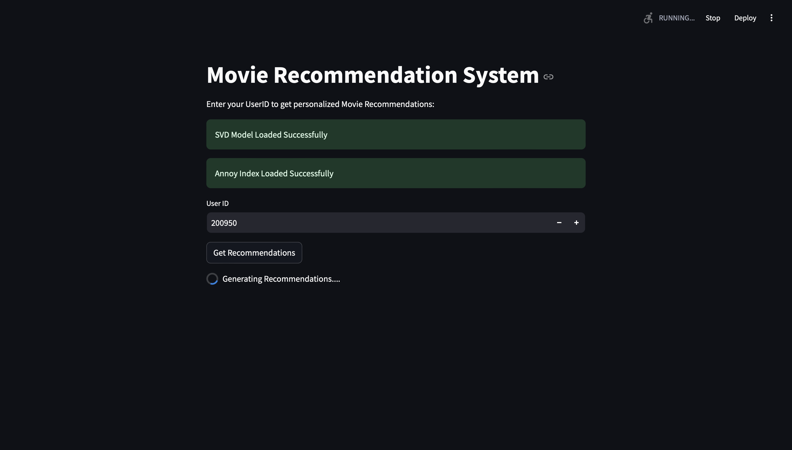
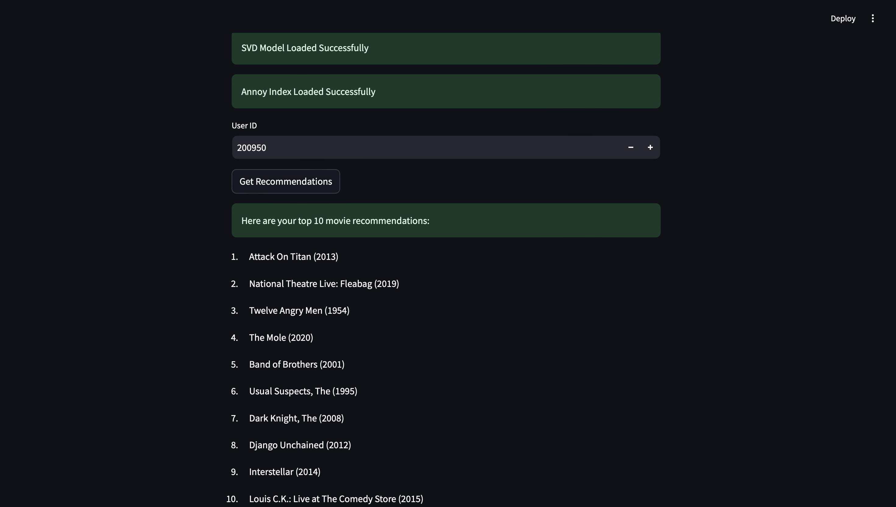

# Movie Recommender System

A hybrid movie recommendation system that combines a Collaborative Filtering Model and a Content Based Model (limited only to similar titles and genres) built using the MovieLens 32M dataset. This system predicts and suggests movies to users based on a combination of their past ratings and the behavior of similar users as well as movies similar to the ones they have already watched and rated highly (and not suggesting movies similar to the ones they rated poorly). Please give it a few minutes to generate some awesome movie recommendations for you!

## Features

- **Personalized Recommendations:** Provides top N movie recommendations for any user.
- **Optimized Model:** Utilizes hyperparameter tuning for enhanced performance.
- **Interactive Interfaces:**
  - **Web App:** Interactive web application built with Streamlit.

## Technologies Used

- **Python 3.12**
- **Pandas & NumPy:** Data manipulation and analysis.
- **Matplotlib & Seaborn:** Data visualization.
- **Scikit-learn & Surprise:** Machine learning and recommendation algorithms.
- **Annoy:** Approximate Nearest Neighbors Oh Yeah) is a library to search for points in space that are close to a given query point
- **Joblib** Save and load Surprise Model
- **TF-IDF Matrix** Converts the text data in the movies['combined_features'] column into a numerical matrix for the Annoy Index
- **Streamlit:** Building the web interface.
- **Git & GitHub:** Version control and repository hosting.

## Installation

1. **Clone the Repository:**

   ```bash
   git clone https://github.com/royayush1/movie-recommender-system.git
   cd movie-recommender-system

2. **Create a Virtual Environment**

   ```bash
   conda create -n movie-recommender
   conda activate movie-recommender

3. **Install Dependencies**

   - If you are running Python 3.12 like me, make sure pip is updated:
   ```bash
     python -m ensurepip --upgrade
    ```
   - Install all necessary libraries to run the web app:
   ```bash
     pip3 install -r requirements.txt

5. **Download the MovieLens 32M Dataset**

   - https://grouplens.org/datasets/movielens/

   - Extract the dataset into Project Directory
  
6. **Extract Annoy Index tgz file**

   - Extract File on Windows
     
   - Untar file on Linux based systems using:
     ```bash
     tar -xzvf annoy_index_ann.tar.gz
     
7. **Make sure svd_model.joblib and annoy_index.ann are in the same level of directory as app.py**

## Usage

1. **Web Interface with Streamlit**

   - Run Streamlist App: streamlit run app.py
   - Interact with application using UserID to view personalized movie recommendations

## 📷 **Screenshots**

<div style="display: flex; justify-content: space-between;">
  <div style="text-align: center;">
    
    <p><strong>Loading Models:</strong> SVD Model and Annoy Index.</p>
  </div>
  <div style="text-align: center;">
    
    <p><strong>Homepage:</strong> Model successfully loaded and waiting for user to input user ID.</p>
  </div>
    <div style="text-align: center;">
    
    <p><strong>Generating Recommendations:</strong> Using Collaborative filtering and content based models to generate recommendations.</p>
    </div>
    <div style="text-align: center;">
    
    <p><strong>Recommendations:</strong> Displayed movie suggestions.</p>
    </div>
</div>


## Contributors

1. Ayush Roy - royayush1 (Github ID)


